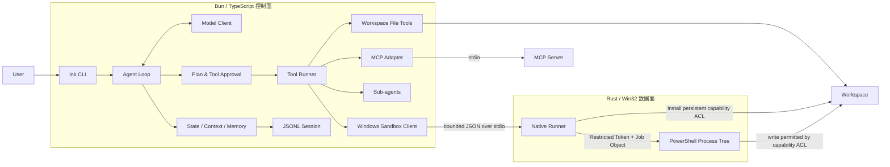

# Coding Agent Lab

[](https://github.com/asdukw/coding-agent-lab/actions/workflows/ci.yml)

> An implementation-driven study of modern coding agents.
>
> 通过独立实现核心控制面，理解现代 Coding Agent 的工程机制。

Coding Agent Lab 是一个学习型工程项目。Claude Code 与 Codex 是它最重要的学习参照：我已经系统学习了 LLM Agent 的核心理论，希望通过独立设计和实现，把 Agent Loop、工具调用、权限控制、上下文管理、持久化与进程隔离真正落到一个可运行、可测试的系统中。

这个项目不以复刻某个产品或成为商业替代品为目标。它更关注一个问题：**当不可信的模型输出开始读取代码、修改文件和启动进程时，控制面需要建立怎样的边界，才能让整个执行过程可理解、可恢复、可验证？**

## 学习目标

- 将 Agent 理论转化为完整的请求—工具—状态循环，而不只停留在 Prompt 或 API 调用层。
- 理解现代 Coding Agent 中计划、审批、上下文压缩、记忆与 Sub-agent 的协作方式。
- 处理真实工程问题：路径边界、并发资源、取消与退出、崩溃恢复、协议校验和跨平台 CI。
- 对安全能力保持准确表述，明确区分“受控副作用”与“完整恶意代码隔离”。

## 已实现的内容

### Agent Runtime

- 基于流式模型响应的 Agent Loop，以及结构化 Tool Call 协议。
- `Read`、`Write`、`Edit`、`Glob`、`Grep` 与 Windows `Shell` 内置工具。
- Plan Mode、运行时计划状态与显式计划审批。
- 前台/后台 Sub-agent、Mailbox 通知、取消与资源感知调度。
- 上下文压缩、有界工具执行记忆和独立 Memory Extraction Agent。
- stdio MCP Server 发现、工具注册、调用与生命周期清理。

### 权限与持久化

- 危险工具整批暂停，支持单次允许、进程会话允许和拒绝。
- 文件工具限制在规范化 workspace 内，并保护 `.env*`、`.git` 与 Agent 控制数据。
- 项目级 `AGENTS.md` / `CLAUDE.md` 指令发现、层级覆盖与大小限制。
- JSONL Session 事件日志、同一进程内的同 Session 增量写入串行化、尾部修复和 Session Index；完整快照通过同目录临时文件原子替换。
- 恢复时容忍最后一条未写完整的 JSON；中间 JSON 损坏、元数据顺序或字段语义不一致会明确失败。
- `/resume` 恢复时不持久化进程级授权，并重新验证待审批工具调用。

### Windows 原生执行边界

- TypeScript 控制面通过有界 JSON 协议调用独立 Rust runner。
- Restricted Token、路径作用域 Capability ACL、Job Object 与继承句柄白名单。
- 环境变量白名单、有界 stdout/stderr、超时与普通子进程树清理。
- Windows CI 直接运行 Release runner，验证允许写入与拒绝写入两侧行为。

## 架构



这条链路也是项目的主要学习主线：

```text
不可信模型输出
  → Schema 与状态机
  → 计划/工具审批
  → 资源锁与路径重校验
  → 文件工具或原生 Sandbox
  → 可恢复的 Session 事件日志
```

## 快速开始

### 1. 安装依赖

项目固定使用 Bun `1.3.14`：

```powershell
bun install
```

### 2. 配置模型

当前真实模型适配器使用 DeepSeek 的 OpenAI-compatible API。请在启动 Agent 的父进程中设置环境变量；项目刻意禁用了 Bun 自动加载 workspace `.env*`：

```powershell
$env:DEEPSEEK_API_KEY = "your-key"
$env:DEEPSEEK_BASE_URL = "https://api.deepseek.com"
$env:DEEPSEEK_MODEL = "deepseek-v4-flash"
```

如果未设置 `DEEPSEEK_API_KEY`，应用会使用确定性的 Stub Model，适合查看 UI、Session 和基础交互，但不会执行真实 Coding Agent 推理。Windows 启动仍会初始化原生 Sandbox，因此即使使用 Stub，也需要先完成下一步的 runner 构建。

### 3. Windows：构建原生 Sandbox runner

Windows 是当前的主要开发平台。启动 CLI 前需要安装 Rustup 与 Visual Studio 2022 C++ Build Tools，并安装固定 Rust 工具链：

```powershell
rustup toolchain install 1.96.0-x86_64-pc-windows-msvc --profile minimal
```

然后构建并安装 runner：

```powershell
bun run build:sandbox
```

脚本使用固定的 `1.96.0-x86_64-pc-windows-msvc` 工具链，将 Release runner 安装到：

```text
%USERPROFILE%\AppData\Local\cagent\bin\cagent-windows-sandbox-runner.exe
```

Ubuntu 可以运行控制面和离线测试，但不会注册内置 `Shell` 工具。其他平台尚未作为支持目标验证。

### 4. 启动

交互式启动：

```bash
bun run start
```

也可以直接附带初始任务：

```bash
bun run start "分析当前仓库并给出下一步计划"
```

## 交互命令

| 输入 | 作用 |
| --- | --- |
| `/plan` | 进入 Plan Mode，计划获批前不执行修改 |
| `/resume <session-id>` | 恢复指定 Session |
| `/memory` | 初始化并显示当前 workspace 的 Memory Store |
| `approve` | 批准待执行计划 |
| `reject <feedback>` | 拒绝计划并要求修改 |
| `allow` | 仅批准当前工具调用批次 |
| `always` | 在当前进程会话内批准对应工具 |
| `deny` | 拒绝当前危险工具调用 |

`always` 授权不会写入 Session；恢复会话后，待审批调用也必须重新校验。

## MCP 配置

项目只从 workspace 根目录的 `.cagent/mcp.json` 读取配置：

```json
{
  "mcpServers": {
    "example": {
      "type": "stdio",
      "command": "example-mcp-server",
      "args": [],
      "env": {}
    }
  }
}
```

MCP Server 是外部进程，可能拥有 workspace Sandbox 之外的副作用，因此其工具按危险工具执行审批；当前进程内可受 `always` 授权。

## Session 与 Memory

- Session 事件保存在 `.cagent/sessions/*.jsonl`。
- Session Index 保存在 `.cagent/sessions/session_index.jsonl`。
- 长期 Memory 保存在 `.cagent/memory/`。Memory Agent 只能写入这里；主 Agent 也可以通过经过路径和格式验证的 `Write` / `Edit` 更新 topic 文件。
- `.cagent/memory/MEMORY.md` 由系统根据 topic frontmatter 自动维护，不能直接修改。
- Memory Extraction 结果通常写入 Session；若 Session 事件无法持久化，才回退到 `.cagent/audit/memory-extraction/`。

Session、审计和 MCP 配置属于 Agent 控制数据，普通文件工具不能直接访问；`.cagent/memory/` 是唯一受专用验证流程约束的例外。

## 工程验证

```text
# 格式与 lint
bun run check:style

# TypeScript
bun run check

# 离线单元测试
bun run test:unit

# 需要 DEEPSEEK_API_KEY 的连通性测试
bun run test:deepseek
```

```powershell
# Windows Release runner 的真实 E2E 由专用 CI 环境显式启用
$env:CAGENT_WINDOWS_SANDBOX_INTEGRATION = "1"
$env:CAGENT_WINDOWS_SANDBOX_HELPER = "C:\absolute\path\to\cagent-windows-sandbox-runner.exe"
bun run test:sandbox
```

GitHub Actions 当前包含：

- Ubuntu Quality：Biome 与 TypeScript。
- Ubuntu / Windows：离线 Bun 测试。
- Windows 2022：Rust fmt、Clippy、单元测试、Release 构建与真实 Sandbox E2E。

## 安全边界

Windows M1 Sandbox 的目标是限制本地文件写入并管理普通子进程树生命周期，它不是虚拟机、容器或完整的保密沙箱。

原生 restricted-token Sandbox **只覆盖内置 `Shell` 工具**。`Read`、`Write` 和 `Edit` 由可信 Bun 控制面直接执行，仅受规范路径与权限策略约束；stdio MCP Server 同样运行在该原生 Sandbox 之外。

当前明确不提供：

- 宿主用户可读文件、注册表、凭据或进程状态的保密隔离。
- 网络隔离。
- 对 WMI、计划任务等系统 Broker 创建的 Job 外进程的完整约束。
- 面对并发恶意宿主进程时的强 TOCTOU 防护。
- 工作区快照、文件变更回滚或跨进程调度。

此外，当前 `bin/cagent` 是源码开发入口。虽然关闭了 dotenv 自动加载，workspace 的 `bunfig.toml` 仍可能在应用入口与 Sandbox 初始化之前执行 preload，因此它不能作为正式的跨重启安全发行入口。

完整协议、信任假设与残余风险见 [`native/windows-sandbox-runner/README.md`](native/windows-sandbox-runner/README.md)。

## 项目结构

```text
src/
  agents/                 Sub-agent runtime 与 mailbox
  mcp/                    MCP 配置、发现与适配
  model/                  模型抽象、DeepSeek 与 Stub
  sandbox/                Windows Sandbox TypeScript 控制面
  tools/                  内置工具、审批与资源调度
  ui/                     Ink 终端界面与生命周期
  query.ts                Agent Loop
  sessionStore.ts         JSONL Session 持久化与恢复
native/
  windows-sandbox-runner/ Rust / Win32 原生 runner
tests/                    Bun 单元测试与 Windows E2E
```

## 项目定位与致谢

Claude Code 与 Codex 是本项目的重要学习参照。本项目基于公开文档、公开可观察行为和通用 Agent 工程原理，独立实现 Coding Agent 的核心控制面；项目使用 Ink、MCP SDK、OpenAI SDK、Zod 等通用基础库，与 Anthropic 或 OpenAI 没有关联，也不包含它们的私有实现。

作为学习项目，我更关注理解设计取舍并留下可验证证据，而不是追求功能清单或对外发布。后续工作会继续围绕架构记录、可重复 Demo、故障注入和性能基线展开。
