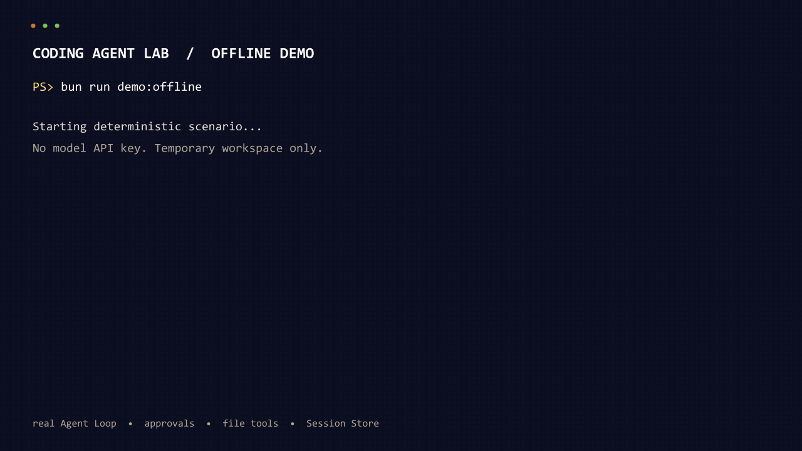
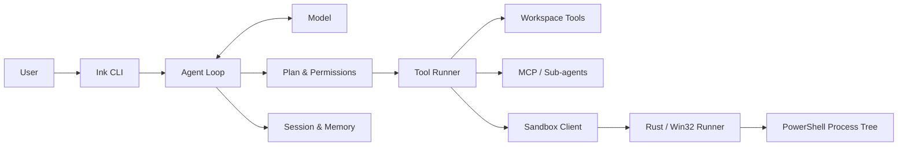

# Coding Agent Lab

[](https://github.com/asdukw/coding-agent-lab/actions/workflows/ci.yml)
[](https://github.com/asdukw/coding-agent-lab/releases/latest)
[](LICENSE)

**从零实现的可审批、可恢复、可验证 Coding Agent 控制面。**

Bun / TypeScript 负责 Agent Loop、权限状态与持久化，Rust / Win32 runner 约束 Windows Shell 的文件写入和普通进程树。项目提供无需 API Key 的确定性端到端 Demo、跨平台 CI 证据和可直接验证的 Windows x64 发行版。

[](docs/demo/offline-demo.sample.md)

## 60 秒离线体验

无需模型 API Key，也不会修改当前仓库：

```bash
bun install --frozen-lockfile
bun run demo:offline
```

Demo 在临时 workspace 中复用真实 Agent Loop、计划审批、文件工具与 Session Store：

```text
进入 Plan Mode → 读取 fixture → 批准计划
  → Read → 批准 Edit → 修改并复查
  → 保存 Session → 恢复 → 完成 follow-up
```

运行结束后会展示控制流、工具结果、恢复状态和验收结果，并生成脱敏的 [Markdown](docs/demo/offline-demo.sample.md) / [JSON](docs/demo/offline-demo.sample.json) 报告。离线 Demo 为保证跨平台与确定性，不注册 `Shell`；Windows Sandbox 由独立 Release runner E2E 验证。

真实模型人工审批场景使用 `bun run demo:deepseek`，配置方式见[使用指南](docs/usage.md#demo)。

## 设计目标

这个项目关注 Coding Agent 中模型调用之外的工程问题：

- **受控副作用**：不可信模型输出必须经过 Schema、状态机、权限策略和路径边界才能执行。
- **可恢复执行**：计划审批、工具批次、Session 和 Memory 都有明确的暂停、恢复与失败语义。
- **可验证主张**：核心能力对应源码入口、自动化测试和确定性 Demo，不用无法复现的演示代替证据。
- **准确的安全表述**：区分 workspace 写入约束、审批控制与完整恶意代码隔离。

## 核心能力与证据

| 能力 | 主要实现 | 自动验证 |
| --- | --- | --- |
| Agent Loop 与结构化工具调用 | [`src/query.ts`](src/query.ts)、[`src/tools/runner.ts`](src/tools/runner.ts) | [`tests/query.tool.test.ts`](tests/query.tool.test.ts) |
| Plan Mode 与工具审批 | [`src/plan.ts`](src/plan.ts)、[`src/tools/permissions.ts`](src/tools/permissions.ts) | [`tests/planMode.test.ts`](tests/planMode.test.ts)、[`tests/permissionApproval.test.ts`](tests/permissionApproval.test.ts) |
| JSONL Session 与严格恢复 | [`src/sessionStore.ts`](src/sessionStore.ts) | [`tests/sessionStore.test.ts`](tests/sessionStore.test.ts) |
| Sub-agent、Mailbox 与调度 | [`src/agents/`](src/agents/) | [`tests/agentManager.test.ts`](tests/agentManager.test.ts)、[`tests/agentMailbox.test.ts`](tests/agentMailbox.test.ts) |
| MCP、长期 Memory 与 Memory Doctor | [`src/mcp/`](src/mcp/)、[`src/memory.ts`](src/memory.ts) | [`tests/mcp.test.ts`](tests/mcp.test.ts)、[`tests/memory.test.ts`](tests/memory.test.ts)、[`tests/memoryDoctor.test.ts`](tests/memoryDoctor.test.ts) |
| Restricted Token Windows 边界 | [`src/sandbox/`](src/sandbox/)、[`native/windows-sandbox-runner/`](native/windows-sandbox-runner/) | [`tests/integration/windowsSandbox.test.ts`](tests/integration/windowsSandbox.test.ts)、[CI](.github/workflows/ci.yml) |
| 可恢复的确定性端到端场景 | [`src/demo/offlineDemo.ts`](src/demo/offlineDemo.ts) | `bun run demo:offline`、[CI artifact](.github/workflows/ci.yml) |

## 架构摘要



权限仍使用 `ask`、`auto` 和 `full` 三档命名。`auto` 采用 sandbox-first：workspace 边界内的文件操作和 sandboxed Shell 默认执行；显式请求 `dangerously_disable_sandbox` 或调用外部 MCP 时再进入审批。失败命令不会被控制面自动提权重放。

当前 Win32 runner 约束 workspace 外写入和普通进程树生命周期，**不隔离宿主可读数据与网络**，因此不是虚拟机、容器或完整保密沙箱。完整分层、恢复语义和残余风险见[架构概览](docs/architecture.md)与[原生 runner 说明](native/windows-sandbox-runner/README.md)。

## 5 分钟看代码

| 阅读入口 | 建议关注 | 设计问题 |
| --- | --- | --- |
| [`src/query.ts`](src/query.ts) | Agent Loop、结构化 Tool Call、暂停与继续 | 模型请求如何变成可审批的状态迁移？ |
| [`src/tools/permissions.ts`](src/tools/permissions.ts) | 模式、硬边界与 sandbox bypass | 边界内自动执行和越界审批如何共存？ |
| [`src/sessionStore.ts`](src/sessionStore.ts) | JSONL、尾部修复、快照与恢复校验 | 进程中断后如何可信恢复？ |
| [`native/windows-sandbox-runner/src/windows/mod.rs`](native/windows-sandbox-runner/src/windows/mod.rs) | Restricted Token、ACL、Job Object | 不可信命令启动前如何建立执行边界？ |

## 运行方式

- 无依赖本机 Bun 的 Windows x64 包：[最新 Release](https://github.com/asdukw/coding-agent-lab/releases/latest)
- 源码安装、模型配置、Windows runner、权限与命令：[使用指南](docs/usage.md)
- 代码检查、测试、CI 和发版：[开发与验证](docs/development.md)

Windows 是主要运行平台；Ubuntu 可以运行控制面、离线 Demo 和单元测试，但不注册内置 `Shell`。其他平台尚未作为支持目标验证。

## 文档

| 文档 | 内容 |
| --- | --- |
| [使用指南](docs/usage.md) | 安装、启动、权限模式、交互命令、MCP、Session 与 Memory |
| [架构概览](docs/architecture.md) | 分层、信任边界、状态恢复、并发和证据边界 |
| [开发与验证](docs/development.md) | 项目结构、源码入口、本地检查、CI 与发版 |
| [Windows runner](native/windows-sandbox-runner/README.md) | 原生协议、构建、安全承诺与残余风险 |
| [ADR](docs/adr/) | 关键设计决策及备选方案 |
| [Release notes](docs/releases/) | 各版本变化与已知边界 |

## 项目定位

Coding Agent Lab 是学习型工程项目。Claude Code 与 Codex 是重要学习参照；本项目基于公开文档、公开可观察行为和通用 Agent 工程原理独立实现，不包含 Anthropic 或 OpenAI 的私有实现，也不与两家公司关联。

公开发行用于提供可复现的验证入口，而不是把项目包装成商业产品替代品。项目重点是理解设计取舍、留下工程证据，并明确说明尚未解决的边界。
