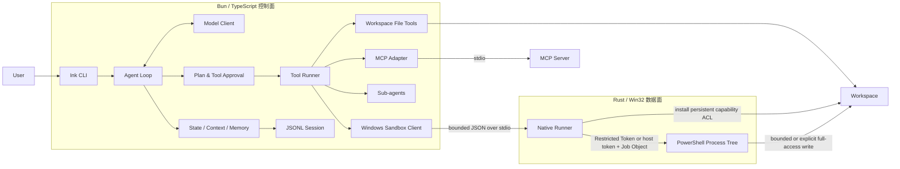

# Coding Agent Lab

[](https://github.com/asdukw/coding-agent-lab/actions/workflows/ci.yml)

> An implementation-driven study of modern coding agents.
>
> 通过独立实现核心控制面，理解现代 Coding Agent 的工程机制。

Coding Agent Lab 是一个学习型工程项目。Claude Code 与 Codex 是它最重要的学习参照：我已经系统学习了 LLM Agent 的核心理论，希望通过独立设计和实现，把 Agent Loop、工具调用、权限控制、上下文管理、持久化与进程隔离真正落到一个可运行、可测试的系统中。

这个项目不以复刻某个产品或成为商业替代品为目标。它更关注一个问题：**当不可信的模型输出开始读取代码、修改文件和启动进程时，控制面需要建立怎样的边界，才能让整个执行过程可理解、可恢复、可验证？**

## 60 秒离线体验

无需模型 API Key。依赖安装完成后，Demo 不访问模型网络，也不会修改当前仓库：

```bash
bun install --frozen-lockfile
bun run demo:offline
```

Demo 在临时 workspace 中复用真实 Agent Loop、计划审批、文件工具与 Session Store，固定演示：

```text
进入 Plan Mode → 读取 fixture → 提交并批准计划
  → Read → 批准 Edit → 修改并复查
  → 保存 Session → load → 继续一次真实 follow-up
```

执行完成后，终端仪表盘会直接展示控制流、模型阶段、工具、审批、Session 恢复、验收与安全边界，同时保留脱敏的 JSON 与 Markdown 报告并打印其临时目录。任一状态转换、工具结果、持久化或恢复断言失败都会展示失败阶段、失败检查与报告位置，并返回非零退出码。CI 会在 Ubuntu 和 Windows 分别执行相同场景，并上传带平台与 run-attempt 标识的 `offline-demo-*` artifact。

离线 Demo 为保证跨平台和确定性，显式只注册 Plan、`Read` 与 `Edit` 工具，不暴露 `Shell`；Windows 原生 Sandbox 由独立 Release runner E2E 验证。

## 真实 DeepSeek 体验（人工审批）

如果想观察真实模型如何制定计划、申请修改并根据工具结果继续执行任务，可以复制示例配置并填写 API Key：

```powershell
Copy-Item .env.example .env
# 编辑 .env，填写 DEEPSEEK_API_KEY
bun run demo:deepseek
```

也可以不创建 `.env`，直接在父进程中设置 `DEEPSEEK_API_KEY`。Demo 会把同一份 fixture 复制到系统临时 workspace，只向模型提供 `Read`、`Edit`、`UpdatePlan` 与 `ExitPlanMode`，不暴露 `Shell`。计划和 `Edit` 批次都通过编号审批菜单选择，不需要键入英文命令，也不存在自动批准模式。

完成后终端会展示模型回复、工具请求与结果、最终 diff，以及脱敏的 JSON / Markdown 报告路径。仓库中的 fixture 不会被修改，API Key、完整 Prompt、模型输出和工具参数不会写入报告。该流程会访问真实 DeepSeek API，输出与调用次数并不确定，可能产生 API 费用，因此只用于本地人工演示，不进入常规 CI。

## 能力与工程证据

| 能力 | 主要实现 | 自动验证 |
| --- | --- | --- |
| Agent Loop 与结构化工具调用 | [`src/query.ts`](src/query.ts)、[`src/tools/runner.ts`](src/tools/runner.ts) | [`tests/query.tool.test.ts`](tests/query.tool.test.ts) |
| Plan Mode 与危险操作审批 | [`src/plan.ts`](src/plan.ts)、[`src/tools/permissions.ts`](src/tools/permissions.ts) | [`tests/planMode.test.ts`](tests/planMode.test.ts)、[`tests/permissionApproval.test.ts`](tests/permissionApproval.test.ts) |
| JSONL Session、崩溃恢复与严格校验 | [`src/sessionStore.ts`](src/sessionStore.ts) | [`tests/sessionStore.test.ts`](tests/sessionStore.test.ts) |
| Sub-agent、Mailbox 与资源调度 | [`src/agents/`](src/agents/) | [`tests/agentManager.test.ts`](tests/agentManager.test.ts)、[`tests/agentMailbox.test.ts`](tests/agentMailbox.test.ts) |
| MCP 与长期 Memory | [`src/mcp/`](src/mcp/)、[`src/memory.ts`](src/memory.ts) | [`tests/mcp.test.ts`](tests/mcp.test.ts)、[`tests/memory.test.ts`](tests/memory.test.ts) |
| 只读 Memory Doctor | [`src/memoryDoctor.ts`](src/memoryDoctor.ts) | [`tests/memoryDoctor.test.ts`](tests/memoryDoctor.test.ts)、[`tests/memoryDoctorCli.test.ts`](tests/memoryDoctorCli.test.ts) |
| Restricted Token Windows 执行边界 | [`src/sandbox/`](src/sandbox/)、[`native/windows-sandbox-runner/`](native/windows-sandbox-runner/) | [`tests/integration/windowsSandbox.test.ts`](tests/integration/windowsSandbox.test.ts)、[CI](.github/workflows/ci.yml) |
| 可恢复的确定性端到端场景 | [`src/demo/offlineDemo.ts`](src/demo/offlineDemo.ts)、[`src/demo/scriptedDemoModel.ts`](src/demo/scriptedDemoModel.ts) | `bun run demo:offline`、[CI artifact](.github/workflows/ci.yml) |

更完整的分层与信任边界见 [`docs/architecture.md`](docs/architecture.md)，关键设计取舍记录在 [`docs/adr/`](docs/adr/)。

## Windows x64 发行版

GitHub Release 提供不依赖本机 Bun、npm link 或 shebang 的 Windows x64 ZIP。下载 ZIP 与同名 `.sha256` 后，先校验 SHA256，再解压到目标仓库之外的稳定目录，例如 `%LOCALAPPDATA%\Programs\CodingAgentLab\v0.1.1`。包内的 `cagent.exe` 与 `cagent-windows-sandbox-runner.exe` 必须保持同目录：

```powershell
Set-Location C:\path\to\target-repository
C:\path\to\CodingAgentLab\cagent.exe --version
C:\path\to\CodingAgentLab\cagent.exe "分析当前仓库"
```

发行 EXE 支持 `--help`、`--version`、`--resume <session-id>` 和 `--memory-check`，不会读取目标 workspace 的 `.env`，也不会经过目标 workspace 的 Bun 启动配置。当前二进制未做代码签名，且 runner 若位于可写 workspace 内会被安全策略拒绝。

## 学习目标

- 将 Agent 理论转化为完整的请求—工具—状态循环，而不只停留在 Prompt 或 API 调用层。
- 理解现代 Coding Agent 中计划、审批、上下文压缩、记忆与 Sub-agent 的协作方式。
- 处理真实工程问题：路径边界、并发资源、取消与退出、崩溃恢复、协议校验和跨平台 CI。
- 对安全能力保持准确表述，明确区分“受控副作用”与“完整恶意代码隔离”。

## 已实现的内容

### Agent Runtime

- 基于流式模型响应的 Agent Loop，以及结构化 Tool Call 协议。
- `Read`、`Write`、`Edit`、`Glob`、`Grep` 与 Windows `Shell` 内置工具。
- Plan Mode、运行时计划状态与显式计划审批。
- 前台/后台 Sub-agent、Mailbox 通知、取消与资源感知调度。
- 上下文压缩、有界工具执行记忆和独立 Memory Extraction Agent。
- stdio MCP Server 发现、工具注册、调用与生命周期清理。

### 权限与持久化

- `/permissions` 将审批策略与沙箱策略组合成三档预设：`ask` 对文件修改、Shell 与 MCP 逐次询问；`auto` 自动批准 workspace 内的文件修改，但在网络尚未隔离的 Windows Shell 和外部 MCP 前仍询问；`full` 同时关闭交互审批与文件系统沙箱。
- `ask` 与 `auto` 保留 workspace、`.env*` / `.git`、Sub-agent 和 Windows Sandbox 边界；`full` 使用宿主用户的文件、环境变量和网络权限，属于显式危险模式。默认模式为 `ask`。
- 切换权限模式会先取消并等待当前 Session 的活跃 Sub-agent 全部停止，再使新策略生效；旧模式下的 Session 工具授权不会跨模式保留。
- 危险工具整批暂停，支持单次允许、进程会话允许和拒绝。
- 文件工具限制在规范化 workspace 内，并保护 `.env*`、`.git` 与 Agent 控制数据。
- 项目级 `AGENTS.md` / `CLAUDE.md` 指令发现、层级覆盖与大小限制。
- JSONL Session 事件日志、同一进程内的同 Session 增量写入串行化、尾部修复和 Session Index；完整快照通过同目录临时文件原子替换。
- 恢复时容忍最后一条未写完整的 JSON；中间 JSON 损坏、元数据顺序或字段语义不一致会明确失败。
- `/resume` 恢复时不持久化进程级授权，并重新验证待审批工具调用。

### Windows 原生执行边界

- TypeScript 控制面通过有界 JSON 协议调用独立 Rust runner。
- Restricted Token、路径作用域 Capability ACL、Job Object 与继承句柄白名单。
- workspace 中的硬链接会按当前沙箱 SID 自动降为只读，而不会阻止无关 Shell 命令启动；这兼容 Bun 的全局缓存硬链接，同时避免通过 workspace 别名修改缓存实体。
- 受限模式使用环境变量白名单，Full Access 继承宿主环境；两种模式都保留有界 stdout/stderr、超时与普通子进程树清理。
- Windows CI 直接运行 Release runner，验证允许写入与拒绝写入两侧行为。

## 架构



这条链路也是项目的主要学习主线：

```text
不可信模型输出
  → Schema 与状态机
  → 计划/工具审批
  → 资源锁与路径重校验
  → 文件工具或原生 Sandbox
  → 可恢复的 Session 事件日志
```

## 快速开始

### 1. 安装依赖

项目固定使用 Bun `1.3.14`：

```powershell
bun install
```

### 2. 配置模型

当前真实模型适配器使用 DeepSeek 的 OpenAI-compatible API。源码 `start` 入口和 Windows 发行 EXE 不自动加载 workspace `.env*`，请在启动 Agent 的父进程中设置环境变量：

```powershell
$env:DEEPSEEK_API_KEY = "your-key"
$env:DEEPSEEK_BASE_URL = "https://api.deepseek.com"
$env:DEEPSEEK_MODEL = "deepseek-v4-flash"
```

源码 `dev` 为本仓库开发便利而显式使用 `--env-file=.env` 并开启 watch，只应在可信的项目副本中运行。`demo:deepseek` 也提供受限 dotenv 加载：它只读取仓库根目录 `.env` 中的 `DEEPSEEK_API_KEY`、`DEEPSEEK_BASE_URL` 和 `DEEPSEEK_MODEL`，而且不会覆盖父进程中已经存在的同名变量。请勿提交包含密钥的 `.env`。

如果未设置 `DEEPSEEK_API_KEY`，应用会使用确定性的 Stub Model，适合查看 UI、Session 和基础交互，但不会执行真实 Coding Agent 推理。Windows 启动仍会初始化原生 Sandbox，因此即使使用 Stub，也需要先完成下一步的 runner 构建。

### 3. Windows：构建原生 Sandbox runner

Windows 是当前的主要开发平台。运行内置 `Shell` 需要通过 MSI 或 ZIP 安装在 `Program Files` 的 PowerShell 7；Microsoft Store 的 WindowsApps 版本无法在 Restricted Token 下直接启动，因而会被拒绝。源码构建 runner 还需要 Rustup 与 Visual Studio 2022 C++ Build Tools，并安装固定 Rust 工具链：

```powershell
rustup toolchain install 1.96.0-x86_64-pc-windows-msvc --profile minimal
```

然后构建并安装 runner：

```powershell
bun run build:sandbox
```

脚本使用固定的 `1.96.0-x86_64-pc-windows-msvc` 工具链，将 Release runner 安装到：

```text
%USERPROFILE%\AppData\Local\cagent\bin\cagent-windows-sandbox-runner.exe
```

Ubuntu 可以运行控制面和离线测试，但不会注册内置 `Shell` 工具。其他平台尚未作为支持目标验证。

发行 ZIP 已包含 runner，不需要本机 Rust 或 Visual Studio，但仍需要上述标准 PowerShell 7 安装。

### 4. 启动

交互式启动：

```bash
bun run start
```

也可以直接附带初始任务：

```bash
bun run start "分析当前仓库并给出下一步计划"
```

无需启动模型、MCP、Windows Sandbox 或交互界面，即可只读检查当前 workspace 的 Memory：

```bash
bun run start --memory-check
```

退出码 `0` 表示扫描完成且没有问题，`1` 表示发现可治理问题，`2` 表示扫描无法可信完成，包括路径安全失败、不可读文件、文件系统错误或并发修改。

## 交互命令

| 输入 | 作用 |
| --- | --- |
| `/plan` | 进入 Plan Mode，计划获批前不执行修改 |
| `/permissions` | 打开权限模式选择器；支持方向键、数字键与回车选择 |
| `/permissions ask\|auto\|full` | 直接切换权限模式 |
| `/resume <session-id>` | 恢复指定 Session |
| `/memory` | 初始化并显示当前 workspace 的 Memory Store |

计划和工具审批统一显示为 Codex 风格单选菜单：使用 `↑`/`↓` 与 Enter，或直接按数字快捷键。工具审批可选择仅批准当前批次、在当前进程会话内不再询问这些工具，或拒绝；计划拒绝后会进入可选反馈输入。Esc 对待执行操作采用安全取消，对 `/permissions` 则保持原模式并关闭菜单。

权限模式与“本会话不再询问”授权都不会写入 Session；恢复会话时回到 `ask`，待审批调用也必须重新校验。切换权限模式会清除已有的进程级授权和待审批决定。

## MCP 配置

项目只从 workspace 根目录的 `.cagent/mcp.json` 读取配置：

```json
{
  "mcpServers": {
    "example": {
      "type": "stdio",
      "command": "example-mcp-server",
      "args": [],
      "env": {}
    }
  }
}
```

MCP Server 是外部进程，可能拥有 workspace Sandbox 之外的副作用，因此其工具按危险工具执行审批；当前进程内可选择“本会话不再询问”。

## Session 与 Memory

- Session 事件保存在 `.cagent/sessions/*.jsonl`。
- Session Index 保存在 `.cagent/sessions/session_index.jsonl`；每个 Session 只保留最新条目，并通过同目录临时文件原子替换。
- 长期 Memory 保存在 `.cagent/memory/`。Memory Agent 只能写入这里；主 Agent 也可以通过经过路径和格式验证的 `Write` / `Edit` 更新 topic 文件。
- `.cagent/memory/MEMORY.md` 由系统根据 topic frontmatter 自动维护，不能直接修改。
- Memory mutation 通过 SQLite 锁在同/跨进程间串行化；取得事务后先执行完整性检查，锁库损坏时 fail-closed。`Edit` 将读取、替换、校验、原子写入和索引刷新放在同一事务边界内，并在提交前检测文件身份或内容冲突。
- `--memory-check` 是严格只读的 Memory Doctor：报告无效 frontmatter、过大或不可读 topic、精确重复、过期 topic，以及索引缺失、错位或漂移；它不会创建 Store、索引、锁库或执行自动修复。
- Memory Extraction 结果通常写入 Session；若 Session 事件无法持久化，才回退到 `.cagent/audit/memory-extraction/`。

Session、审计和 MCP 配置属于 Agent 控制数据，普通文件工具不能直接访问；`.cagent/memory/` 是唯一受专用验证流程约束的例外。

## 工程验证

```text
# 格式与 lint
bun run check:style

# TypeScript
bun run check

# 只读 Memory Doctor
bun run start --memory-check

# 确定性离线端到端 Demo
bun run demo:offline

# 需要 DEEPSEEK_API_KEY 和人工审批的真实模型 Demo
bun run demo:deepseek

# 离线单元测试
bun run test:unit

# Memory 跨进程锁专项测试
bun run test:memory-lock

# 需要 DEEPSEEK_API_KEY 的连通性测试
bun run test:deepseek
```

`test:unit` 自动发现 `tests/**/*.test.ts`，排除需要真实凭据或原生 runner 的专用测试，并让每个测试文件在独立 Bun 进程中运行，避免进程级单例或开放句柄跨文件污染。

```powershell
# Windows Release runner 的真实 E2E 由专用 CI 环境显式启用
$env:CAGENT_WINDOWS_SANDBOX_INTEGRATION = "1"
$env:CAGENT_WINDOWS_SANDBOX_HELPER = "C:\absolute\path\to\cagent-windows-sandbox-runner.exe"
bun run test:sandbox
```

GitHub Actions 当前包含：

- Ubuntu Quality：Biome 与 TypeScript。
- Ubuntu / Windows：离线 Bun 测试。
- Ubuntu / Windows：确定性离线 Demo 与脱敏报告 artifact。
- Windows 2022：Rust fmt、Clippy、单元测试、Release 构建与真实 Sandbox E2E。
- `v*` tag：重新执行完整验证，生成 Windows x64 ZIP 与 SHA256，通过打包后 smoke / Sandbox E2E 后发布 GitHub Release。

`demo:deepseek` 与 `test:deepseek` 需要真实凭据、访问外部 API，且结果可能受模型变化影响，因此不在常规 CI 中执行；其中 `demo:deepseek` 还必须由人在终端显式批准计划与文件修改。

## 安全边界

Windows M1 Sandbox 的目标是限制本地文件写入并管理普通子进程树生命周期，它不是虚拟机、容器或完整的保密沙箱。

原生 restricted-token Sandbox **只覆盖内置 `Shell` 工具**。`Read`、`Write` 和 `Edit` 由可信 Bun 控制面直接执行，仅受规范路径与权限策略约束；stdio MCP Server 同样运行在该原生 Sandbox 之外。

当前明确不提供：

- 宿主用户可读文件、注册表、凭据或进程状态的保密隔离。
- 网络隔离。
- 对 WMI、计划任务等系统 Broker 创建的 Job 外进程的完整约束。
- 面对并发恶意宿主进程时的强 TOCTOU 防护。
- 工作区快照、文件变更回滚或跨进程调度。

`bin/cagent` 仍只是源码开发入口：Bun 在 Windows 上无法把多参数 `env -S` shebang 正确映射为全局 shim，而且 workspace `bunfig.toml` 可能在应用入口与 Sandbox 初始化之前执行 preload。正式运行边界是独立编译的 Windows Release EXE；它不经过 Bun CLI 启动配置，并在临时恶意 workspace 中对 `--help` / `--version` 做打包后 smoke 验证。

完整协议、信任假设与残余风险见 [`native/windows-sandbox-runner/README.md`](native/windows-sandbox-runner/README.md)。

## 项目结构

```text
src/
  agents/                 Sub-agent runtime 与 mailbox
  demo/                   离线 / 真实模型场景、报告与 CLI
  mcp/                    MCP 配置、发现与适配
  model/                  模型抽象、DeepSeek 与 Stub
  sandbox/                Windows Sandbox TypeScript 控制面
  tools/                  内置工具、审批与资源调度
  ui/                     Ink 终端界面与生命周期
  query.ts                Agent Loop
  memoryDoctor.ts         只读 Memory 扫描、报告与退出码
  sessionStore.ts         JSONL Session 持久化与恢复
native/
  windows-sandbox-runner/ Rust / Win32 原生 runner
examples/offline-demo/    只读复制到临时 workspace 的共享 Demo fixture
docs/                     架构说明与 ADR
tests/                    Bun 单元测试与 Windows E2E
```

## 项目定位与致谢

Claude Code 与 Codex 是本项目的重要学习参照。本项目基于公开文档、公开可观察行为和通用 Agent 工程原理，独立实现 Coding Agent 的核心控制面；项目使用 Ink、MCP SDK、OpenAI SDK、Zod 等通用基础库，与 Anthropic 或 OpenAI 没有关联，也不包含它们的私有实现。

作为学习项目，我更关注理解设计取舍并留下可验证证据，而不是追求功能清单或对外发布。后续工作会继续围绕 ChangeSet/diff 预览、故障注入和性能基线展开。
